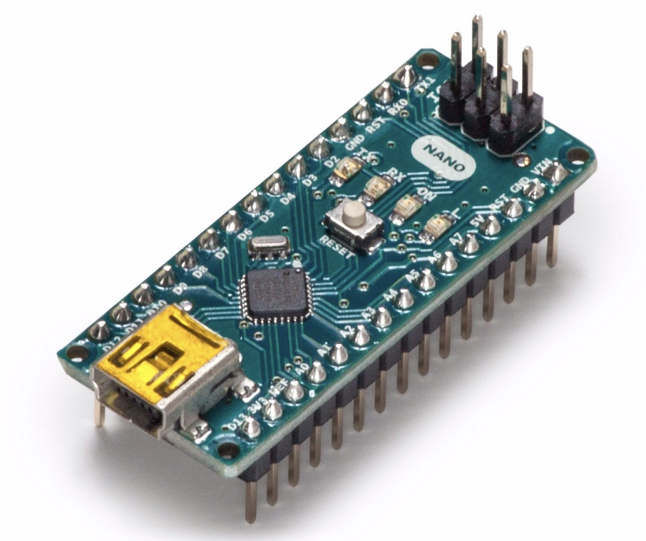

## :rocket: Installatie NANO
Wees er zeker van dat je een NANO hebt. 

### :hamburger: Installeren Arduino IDE 
1. Installeer de Arduino IDE
2. Sluit je NANO aan via een MINI usb kabel op je laptop
3. Selecteer Arduino NANO en de poort (/dev/cu.usbmodem ****)
4. Open File > Examples > 01.Basics > Blink
9. Upload deze file naar je Arduino NANO (command + U)
10. Zie je nu "DONE UPLOADING"? Dan werkt je sorftware en hardware perfect. :trophy:

#### Problemen oplossen
Krijg je ondertaande foutmelding? 
> avrdude: stk500_getsync(): not in sync: resp=0x00

Gebruik dan de oude bootloader: **Tools->Processor->Atmega 328P to Atmega 328P (Old Bootloader)**
