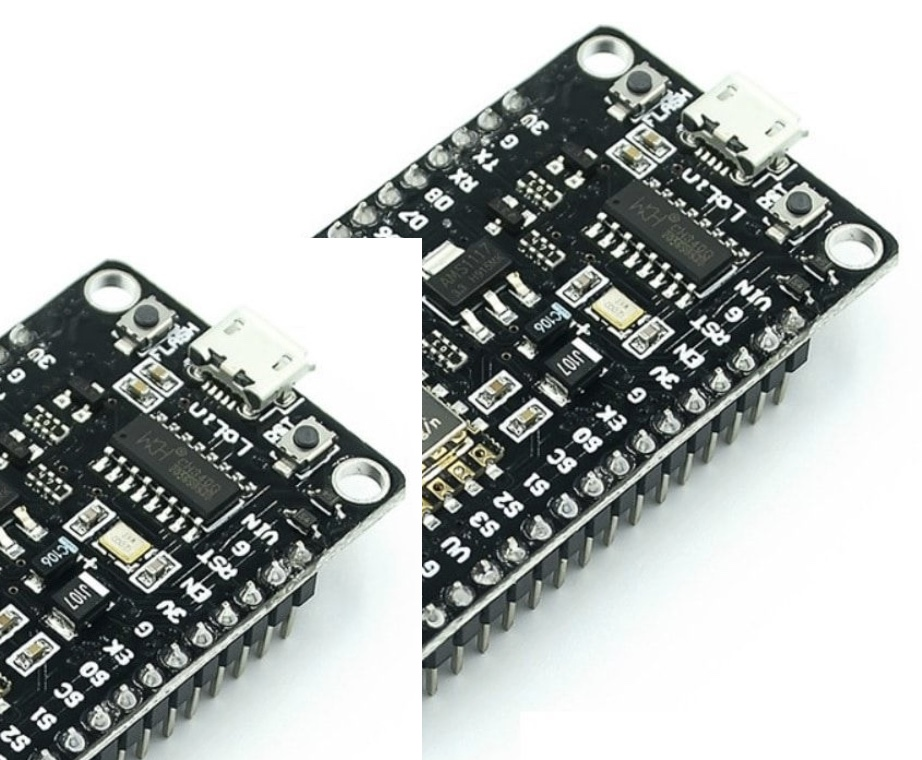
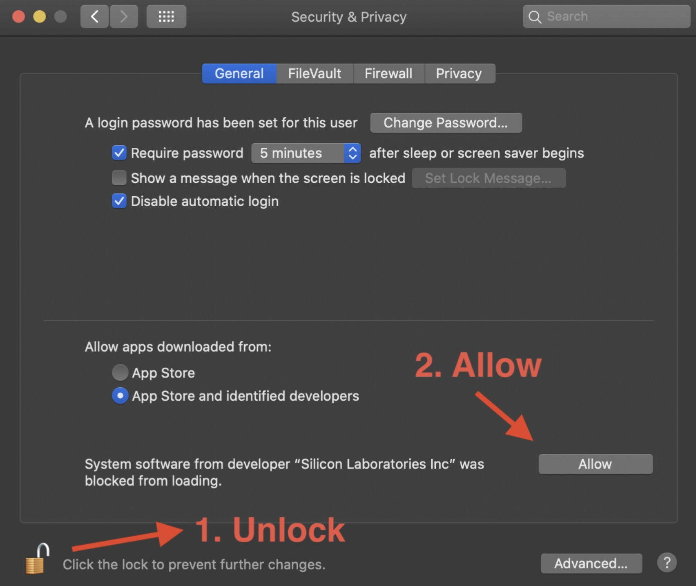

## :rocket: Quickstart NodeMCU

De NodeMCU is een microcontroller-board met een geïntegreerde WiFi module (esp8266). Deze draait ook Arduino software. Om de NodeMCU te kunnen programmeren gaan we in de volgende stappen dit realiseren:

1. Installeren van de Programmeeromgeving (Arduino IDE)
2. De juiste USB driver installeren
2. De NodeMCU Board library installeren
3. De board-settings instellen
4. Eventueel een driver downloaden

De NodeMCU komt in twee versies:
met de 

### :hamburger: Installeren Arduino IDE 
1. Download [Arduino IDE](https://www.arduino.cc/en/software)
2. Sleep deze naar de map 'Applications'
3. Sluit je NodeMCU aan (via USB)
4. Open de Arduino IDE
5. Stel de Arduino IDE in op Engels (via menu "Preferences")

## De NodeMCU Board library installeren
[Video ter ondersteuning:](https://randomnerdtutorials.com/how-to-install-esp8266-board-arduino-ide/)

1. ga naar Arduino IDE > Settings
2. Plak de onderstaande regel achter 'Additional Boardmanager URL's':
`http://arduino.esp8266.com/stable/package_esp8266com_index.json`
3. Klik op 'OK' 
4. Herstart Arduino

## De board-settings instellen
1. Klik nu ' Tools; → 'Board' → 'Boards manager...'
2. Type in het zoekveld: “esp”
3. Selecteer “esp8266 by ESP8266 Community” 
4. Selecteer versie 3.** en klik op ‘Install’
5. Verbind je board met je computer (USB kabel)
6. Kies Tools >  Board > ESP8266 Boards> Selecteer NodeMCU 1.0 (ESP12E module)
7. Kies Tools > Port > selecteer  /dev/cu.SLAB_USBtoUART (of iets wat daar op lijkt)
8. Lukt dit niet? installeer dan de drivers (zie hier onder)

## Test of het gelukt is	
Onderstaande heeft alleen zin als je een board en een port kon selecteren

1. Check of “...USBtoUART”  geselecteerd is (  Tools > Port)
2. kies File → Examples → ESP8266 (ver naar beneden scrollen) → Blink
3. upload deze code
4. Als alles gelukt is zie je ‘Done uploading” EN knippert het LED’je op je board met een ritme van 1 seconde aan/1 seconde uit 

## USB CH340 drivers installeren 
Alleen als je geen code kunt uploaden naar je board

* **windows:** [volg het eerder deel van deze post] (https://medium.com/@cilliemalan/installing-nodemcu-drivers-on-windows-d9bffdbad52)
* **mac:** Heb je macOS 10.13 of later, dan is de CH340 driver niet nodig.

## USB CP210 drivers installeren (mac)
Alleen als je geen code kunt uploaden naar je board

1. Zoek de driver voor OSX): https://www.silabs.com/developers/usb-to-uart-bridge-vcp-drivers?tab=downloads
2. Unzip de VCP file
3. Open SiLabsUS… . dmg (dan opent een map)
4. install CP210x VCP Driver, start de installatie
5. Klik op open in het dialoog venster:
6. Geef toestemming (met je admin Wachtwoord)
7. Ga naar  Preferences > Security & Privacy  en Allow (zie afbeelding hieronder)

## 2. USB drivers installeren (windows)

