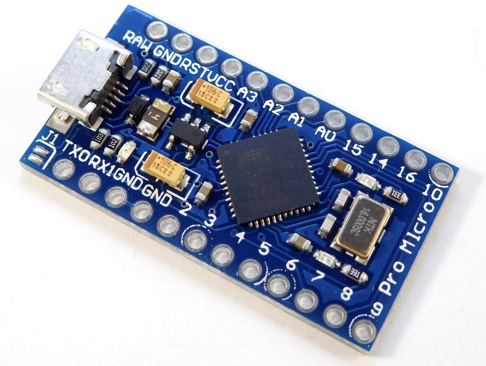

## :rocket: Installatie PRO MICRO
Wees er zeker van dat je een Micro hebt. 

### Check if it all works (you can use this in the future too)
1. Install Arduino
2. Connect board (USB cable)
3. Select board: Arduino MICRO from the dropdown.
4. Select port: You should see the port: /dev/cu.usbmodem*** or simular (Windows = Com port)
5. File → examples→ Basic → Blink
6. Compile and upload: you can use  ‘Command - U'
7. If you see 'Done uploading' and a blinking LED on the Micro, it works!  
