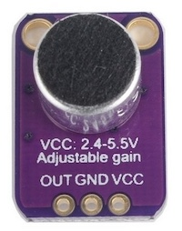
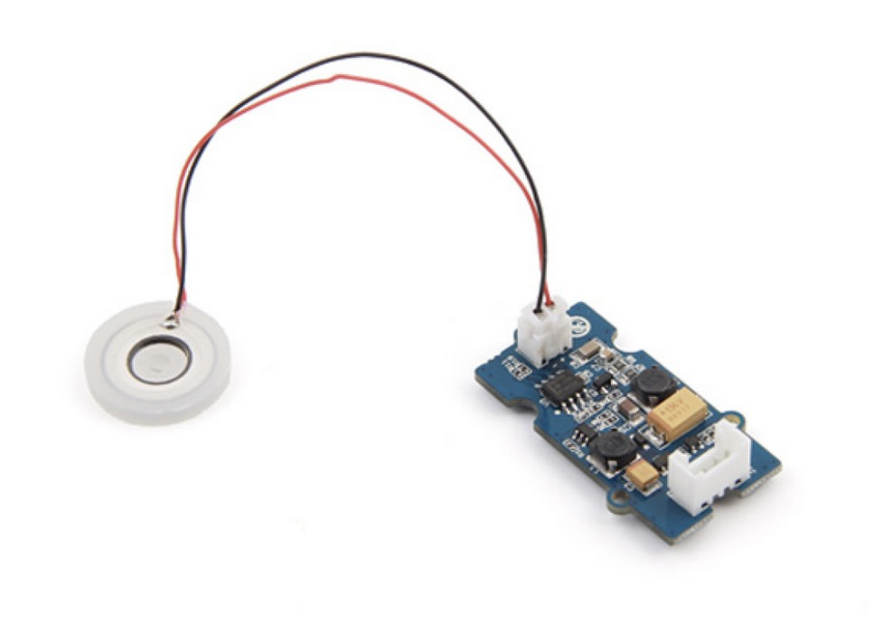
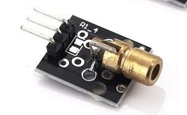
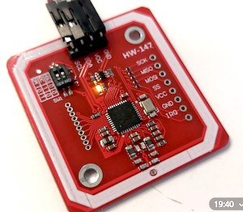

# 🚀 Introduction

All MicroControllers can be found here. You will also find instructions on how to install and use them.

Below is an overview of all Sensors and Actuators (output) available in the lab.

Some components use a Grove connector (white plug), others use pins that require loose (female) jumper wires.
If the connection does not match, you can use an adapter (ask your teacher or Remy).

|                  Name                 |                                                                      Component                                                                     | What it does                                                                                                                                                                                                             |                                                            Code Example                                                            |
| :-----------------------------------: | :------------------------------------------------------------------------------------------------------------------------------------------------: | ------------------------------------------------------------------------------------------------------------------------------------------------------------------------------------------------------------------------ | :--------------------------------------------------------------------------------------------------------------------------------: |
|    **Distance Sensor (Ultrasonic)**   |                                                                     | Sends out an ultrasonic pulse and listens for the echo. The time between sending and receiving determines the distance. Commonly used as a parking sensor in cars.                                                       |                    [Basic Code](https://github.com/harmsel/SensorLab/tree/main/SensorenActuatoren/AfstandSensor)                   |
|          **LED Strip (RGB)**          |                                                                                                                         | Individually controllable RGB LEDs. Has an adhesive backing for easy mounting. ⚠️ **If you use the adhesive or integrate it permanently, you must buy the strip (€5)** so new ones can be purchased for future students. |                   [Basic Code](https://github.com/harmsel/SensorLab/tree/main/SensorenActuatoren/LED-strip-heen)                   |
|            **Light Sensor**           |                                                                                                                            | Analog output: more light → higher value. Connect to **A0**. Useful for day/night detection or interaction with light.                                                                                                   |                 [Basic Code](https://github.com/harmsel/SensorLab/tree/main/SensorenActuatoren/LightSensor-Simple)                 |
|    **Temperature & Humidity (DHT)**   |                                                                                                                           | Measures air temperature and humidity. 💡 **Test by blowing on the sensor** — do **not** use a lighter.                                                                                                                  |                  [Basic Code](https://github.com/harmsel/SensorLab/tree/main/SensorenActuatoren/DHT-TempHumidity)                  |
|         **LED + Push Button**         |                                                                                                                          | Contains a button and an LED. They can be read and controlled independently. Great for basic interaction.                                                                                                                |                      [Basic Code](https://github.com/harmsel/SensorLab/tree/main/SensorenActuatoren/Knop_Led)                      |
|        **Accelerometer (16g)**        |                                                                                                                        | Measures movement and orientation across X, Y, and Z axes (similar to a smartphone). Can detect motion, tilt, gestures, or taps.                                                                                         |                  [Basic Code](https://github.com/harmsel/SensorLab/tree/main/SensorenActuatoren/acceler-16-serial)                 |
|            **Servo Motor**            |  | Rotates between 0–180°. Ideal for prototyping movement. ⚠️ **Avoid extreme positions** to prevent jittering and damage.                                                                                                  |                     [Basic Code](https://github.com/harmsel/SensorLab/tree/main/SensorenActuatoren/ServoSweep)                     |
|      **Vibration Motor (Haptic)**     |                                                                                                                             | Produces vibration for tactile feedback (like in phones). Can also create sound when mounted on hard objects (e.g. glass → bell).                                                                                        |                                 Use **Blink** example and replace `LED_BUILTIN` with your motor pin                                |
|         **Chainable RGB LED**         |                                                                                                                         | Single RGB LED. Usually the LED strip is easier and more flexible, but this is useful for simple setups or learning.                                                                                                     |                    [Basic Code](https://github.com/harmsel/SensorLab/tree/main/SensorenActuatoren/ChainableLed)                    |
|  **MP3 Player + Speaker (OpenSmart)** |                                                                                                                          | MP3 module with SD card and speaker. Can be loud in an enclosure. ⚠️ Limited availability – ask Remy.                                                                                                                    |                    [Basic Code](https://github.com/harmsel/SensorLab/tree/main/SensorenActuatoren/MP3_OpenSmart)                   |
|        **Sound Sensor (Grove)**       |                                                                                                                      | Measures ambient sound intensity using a microphone and amplifier. Useful for clap or noise detection.                                                                                                                   |                                   [Basic Code](https://wiki.seeedstudio.com/Grove-Sound_Sensor/)                                   |
|       **Sound Sensor (MAX4466)**      |                                                                                                                          | Measures sound pressure using an electret microphone and MAX4466 amplifier. More sensitive than Grove version.                                                                                                           |                 [Basic Code](https://github.com/harmsel/SensorLab/tree/main/SensorenActuatoren/SoundSensor_max4466)                |
|      **AI Vision Sensor (Grove)**     |                                                                                                                    | Camera with onboard AI. Can be trained to recognize images or faces. ⚠️ **Use Chrome for uploading models**.                                                                                                             |                                 [Quickstart](https://wiki.seeedstudio.com/Grove-Vision-AI-Module/)                                 |
|    **RFID Reader (125 kHz Grove)**    |                                                                                                                             | Reads RFID tags for identification and interaction.                                                                                                                                                                      |                                [Basic Code](https://wiki.seeedstudio.com/Grove-125KHz_RFID_Reader/)                                |
|      **Capacitive Touch Sensor**      |                                                                                                                                     | Measures touch or proximity of the human body. More contact → higher value in Serial Monitor.                                                                                                                            |        [Basic Code](https://github.com/harmsel/SensorLab/blob/main/SensorenActuatoren/CapacativeSensor/CapacativeSensor.ino)       |
| **Soil Moisture Sensor (Capacitive)** |                                                                                                                   | Measures moisture in soil. Corrosion-resistant version. Useful for plant or environment projects.                                                                                                                        |                  [Basic Code](https://wiki.seeedstudio.com/Grove-Capacitive_Moisture_Sensor-Corrosion-Resistant/)                  |
|    **Water Atomizer (Mist Maker)**    |                                                                                                                 | Creates a fine mist when placed in water. Fun to combine with lasers for visual effects.                                                                                                                                 |                                 [Basic Code](https://wiki.seeedstudio.com/Grove-Water_Atomization/)                                |
|            **Laser Module**           |                                                                                                                            | Emits a red laser dot. Combine with a servo for a cat toy, or build a light barrier. ⚠️ Never shine into eyes.                                                                                                           |                                                    Modify the **Blink** example                                                    |
|     **Heart Rate (Pulse) Sensor**     |                                                                                                                       | Measures heart rate when you place your finger on the sensor.                                                                                                                                                            |                            [Basic Code](https://microcontrollerslab.com/pulse-sensor-arduino-tutorial/)                            |
|         **RFID / NFC – HW147**        |                                                                                                                       | Reads NFC cards and tags, including HvA passes. Useful for identification and access systems.                                                                                                                            |                     [Basic Code](https://github.com/harmsel/SensorLab/tree/main/SensorenActuatoren/RFID_HW-147)                    |
|          **AI Camera Module**         |                                                                                                                         | AI camera module for vision-based projects.                                                                                                                                                                              | [Quickstart](https://icthva.sharepoint.com/:w:/s/FDMCI_ORG__CMD-Amsterdam/EXzyY2UQJuhIqKWNUEoHXqgBHttThaawOR97wrSRfN2FuQ?e=BKxhDG) |
|      **MP3 Player (Grove v2.0)**      |                                                                                                                        | Plays MP3 files from a micro SD card. Requires an external speaker (available from Remy).                                                                                                                                |               [Basic Code](https://github.com/harmsel/SensorLab/blob/main/SensorenActuatoren/MP3-Grove/MP3-Grove.ino)              |
|           **Gesture Sensor**          |                                                          | Recognizes predefined hand gestures (swipe, up, down, etc.).                                                                                                                                                             |                                   [Basic Code](https://wiki.seeedstudio.com/Grove-Gesture_v1.0/)                                   |
|           **Relay (Grove)**           |                                                                                                                      | Allows switching higher power devices using an external power supply. ⚠️ Be careful with voltages.                                                                                                                       |                                       [Basic Code](https://wiki.seeedstudio.com/Grove-Relay/)                                      |
