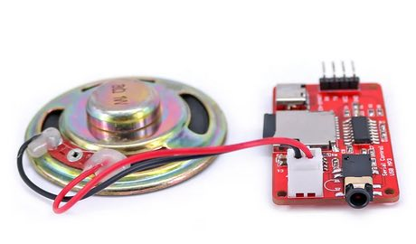
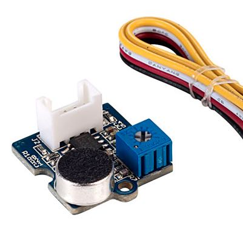
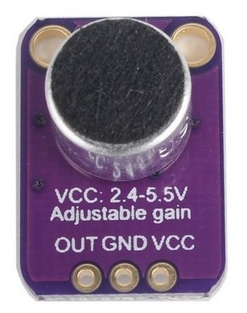
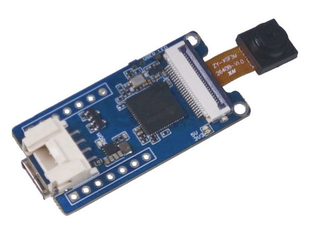
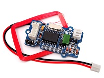
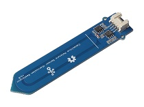
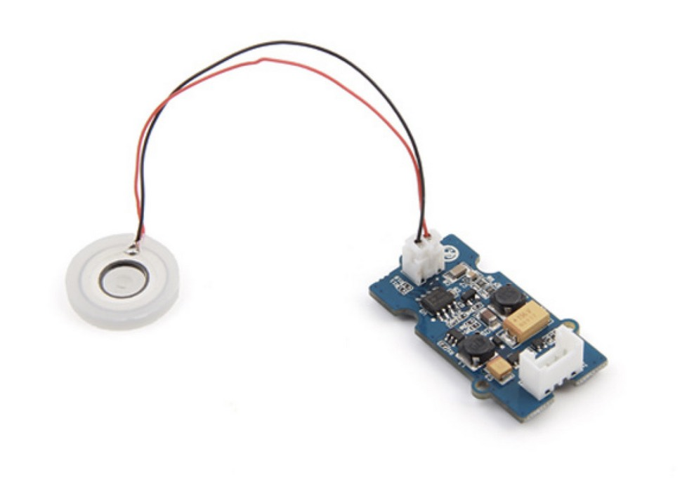
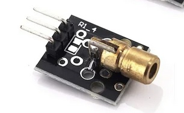
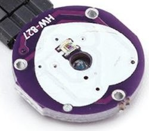
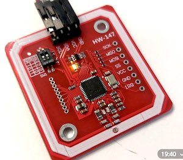

## :rocket: Introductie
In de ['Quick-Starts'](Quick-starts)  kun je vinden hoe je de verschillende Microcontrollers kunt installeren.

Hieronder alle Sensoren en Actuatoren (output) vinden die we hebben. In de mapjes hierboven ['Componenten'](Componenten)  staat de code voor de Sensoren (input) en Actuatoren (output). 

In de Map ['Interactie'](Interactie) staan voorbeelden van combinaties tussen Sensoren en Actuatoren. 

Sensoren en actuatoren hebben soms een Grove aansluiting (wit stekkertje) en soms pinnetje waar je losse (female) draadjes op moet aansluiten. Als de aansluiting niet klopt kun je altijd een verloopje gebruiken (vraag je docent of Remy).

### :eyes: Sensoren

| naam | Sensor   | functie   | Code voorbeeld |
| :---:   | :---: | :---: | :---: |
| Afstand sensor|   | Deze afstandsmeting stuurt een een ultrasoon geluidssignaal uit en ontvangt deze als het geluid weerkaatst is. De tijd tussen versturen en ontvangen is afhankelijk van de afgelegde weg van het geluidssignaal. Zo wordt de afstand tot het object berekend. Deze sensor zit ook in auto’s als parkeersensor. | [Basiscode](https://github.com/harmsel/SensorLab/tree/main/Componenten/AfstandSensor)|
| Led Strip |    | Elke led kan je individueel aansturen in alle RGB kleuren. Er zit een plakrand aan zodat je hem makkelijk kunt verwerken in je project (dus beschadigen). Gebruik je deze plakrand of verwerkt je hem in je project? Dat geen probleem maar je moet hem dan kopen (5 euro per strip). Dan kunnen we nieuwe kopen voor de aankomende studenten | [Basiscode](https://github.com/harmsel/SensorLab/tree/main/Componenten/LED-strip-heen) |
| Lichtsensor |  | De Grove - lichtsensor heeft een analoge output. Hoe feller het licht is, des te hoger de waarde. Je sluit de lichtsensor aan op het A0 stekkertje. | [Basiscode](https://github.com/harmsel/SensorLab/tree/main/Componenten/LightSensor-Simple)|
| Temp. en vocht |    | Deze meet de temperatuur van de lucht en de hoeveelheid vocht in de lucht. Test en demo de werking met blazen in de sensor, liever niet met een aansteker ;-)  | [Basiscode](https://github.com/harmsel/SensorLab/tree/main/Componenten/DHT-TempHumidity) |
| Blauwe LED en Drukknop |     | Dit component bevat een LED lampje en een drukknop. Deze kun je onafhankelijk van elkaar aansturen of uitlezen.   | [Basiscode](https://github.com/harmsel/SensorLab/tree/main/Componenten/Knop_Led) |
| Accelerometer - Bewegingsmeter 16g |   | Zoek bij deze sensor de 16g code. Dit is een sensor die beweging en stand weergeeft over drie assen (x, y en z). Een soortgelijke sensor zit ook in je telefoon. Je kunt ‘m ook programmeren om gebaren en bewegingen te herkennen, of te herkennen als er op getikt wordt. | [Basiscode](https://github.com/harmsel/SensorLab/tree/main/Componenten/acceler-16-serial) |
| Servo |  | De as van dit ‘motortje’ kan draaien over 180 graden en in elke gewenste positie worden geplaatst. Je kunt ook beweging prototypen door de motor heen en weer te laten draaien. Tip: draai de servo niet helemaal in zijn uiterste van het bereik om te voorkomen dat deze gaat trillen.   | [Basiscode](https://github.com/harmsel/SensorLab/tree/main/Componenten/ServoSweep) |
| Trilmotor |  | Deze vibratiemotor (ook wel haptic motor) wordt gebruikt in smartphones en wearables. Je kunt hiermee informatie voelbaar doorgeven. Je kunt hier ook hoorbare feedback mee maken, door het motortje tegen hard materiaal te laten trillen. Hang je hem bijvoorbeeld tegen een glas, dan heb je een bel.| Gebruik de Blink code en vervang 'LedBuildin' voor de pin waar je de trilmotor aansluit|
| Chainable LED |  | Dit component bevat een RGB LED. In de meeste gevallen is de Ledstrip een betere keuze. Een ledstrip heeft dezelfde leds (alleen kleiner) en is gemakkelijker te programmeren. Je kunt ook een ledstrip maken met 1 led. | [Basiscode](https://github.com/harmsel/SensorLab/tree/main/Componenten/ChainableLed) |
| MP3 speler met speaker |  | Dit component heeft een MP3 module, een geheugenkaart en een speaker. Als je deze speaker in een doosje plaatst kan het behoorlijk luid zijn. Er zijn een beperkt aantal van deze modules beschikbaar bij Remy. Je hebt deze code nodig (onder componenten) MP3_OpenSmart|  [Basiscode](https://github.com/harmsel/SensorLab/tree/main/Componenten/MP3_OpenSmart) |
| [Soundsensor Grove](https://wiki.seeedstudio.com/Grove-Sound_Sensor/) |  | Can detect the sound intensity of the environment. The main component of the module is a simple microphone, which is based on the L358 amplifier and an electret microphone. |  [Basiscode](https://wiki.seeedstudio.com/Grove-Sound_Sensor/) |
| [Soundsensor Max 4466](https://lastminuteengineers.com/max4466-arduino-tutorial/) |  | Meet de geluidsdruk. Dit component is gemaakt rondom een  Electret microfoon en een versterker Max 4466. Code voorbeeld. |  [Basiscode](https://github.com/harmsel/SensorLab/tree/main/Componenten/SoundSensor_max4466) |
| [AI sensor](https://wiki.seeedstudio.com/Grove-Vision-AI-Module/) |  | Herkent afbeeldingen en gezichten, je kunt deze module zelf trainen. Belangrijk om te onthouden, gebruik chrome voor het uploaden van modellen. | [Quickstart](https://wiki.seeedstudio.com/Grove-Vision-AI-Module/)|
| [RFID sensor](https://wiki.seeedstudio.com/Grove-125KHz_RFID_Reader/) |  | Je kunt verschillende RFID tags herkennen | [Basiscode](https://wiki.seeedstudio.com/Grove-125KHz_RFID_Reader/) |
| [Capacative sensor](https://github.com/harmsel/SensorLab/blob/main/Componenten/CapacativeSensor/CapacativeSensor.ino) |  | Deze meet aanraking en nabijheid van een (deel van) je lichaam. Dus je kunt deze als aanraaksensor of nabijheid sensor gebruiken. Hoe meer aanraking, des te hoger de waarde in je serial monitor | [Basiscode](https://github.com/harmsel/SensorLab/blob/main/Componenten/CapacativeSensor/CapacativeSensor.ino) |
| [Moisture sensor (aarde)](https://wiki.seeedstudio.com/Grove-Capacitive_Moisture_Sensor-Corrosion-Resistant/) |  | Deze meet aanraking en nabijheid van een (deel van) je lichaam. Dus je kunt deze als aanraaksensor of nabijheid sensor gebruiken. Hoe meer aanraking, des te hoger de waarde in je serial monitor | [Basiscode](https://wiki.seeedstudio.com/Grove-Water_Atomization/) |
| [Watervernevelaar](https://wiki.seeedstudio.com/Grove-Water_Atomization/) |  | Deze leg je in een bakje water en zal dan een kleine mist veroorzaken, leuk om met lasers op te stralen. Lasers hebben we ook voldoende. |  [Basiscode](https://wiki.seeedstudio.com/Grove-Water_Atomization/) |
| [Laser](https://www.instructables.com/Laser-Diode-Module-Tutorial/) |  | Deze maakt een klein rood puntje. Samen met een servo kun je hier een automatisch katspeeltje maken. Verder heel goed om [een lichtsluis te maken](https://www.instructables.com/How-to-Make-a-Laser-Security-System-Using-Arduino-/) , of rook rook of nevel de straal zichtbaar te maken. | Sluit aan op een D poort en verander de standaard blink code.|
| [Hart pulse sensor](https://microcontrollerslab.com/pulse-sensor-arduino-tutorial/) |  | Hiermee kun je je hartslag meten door je vinger op de sensor te houden|  [Basiscode](https://microcontrollerslab.com/pulse-sensor-arduino-tutorial/) |
| [RFID - NFC - HW147](https://microcontrollerslab.com/pulse-sensor-arduino-tutorial/) |  | Meet verschillende tags/NFC kaarten, je kunt ook de HvA passen gebruiken om verschillende mensen te identificeren, |  [Basiscode](https://microcontrollerslab.com/pulse-sensor-arduino-tutorial/) |

### :anger: Fouten oplossen
Check **altijd eerst** of het een code of hardware probleem is:

1. Selecteer de Uno en de Port (”/dev/cu.usbserial**’MAC of "COM" voor Windows)
3. Open een lege sketch (File > New of druk 'command + n') 
4. Upload deze lege sketch (of 'command + u')

**Het uploaden van een lege sketch lukt niet**

1. Staat je Port er niet bij? Ruil dan je hardware (en kabel) even met je Buur
2. Windows? Installeer de driver (zie onder laaste stap 'installeren Arduino IDE')
3. Sluit je Arduino op een andere poort aan op je Laptop
4. Kijk nogmaals naar [https://youtu.be/C6NZ1WOGFKw]()
5. Ga bij Remy langs en kijk of een andere versie hardware wel werkt

**Lukt het uploaden van een lege sketch?** Dan zijn de foutmeldingen veroorzaakt door een probleem in je code. 

1. Ga terug naar een versie die wel werkte (het is verstandig om versies te maken van je bestanden)
2. Kijk naar de foutmelding (letterlijke tekst)
3. Kijk waar de fout ontstaat (roze balk)

