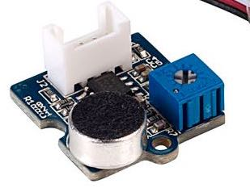

## :rocket: Introductie
Als we het hebben over 'Arduino' dan kan dit gaan over verschillende dingen:
1. De software (IDE)
2. De Hardware (UNO of andere Microcontrollers)
3. Het platform (dus het type software en hardware)

In de 'Quick-Starts' kun je vinden hoe je de verschillende Microcontrollers kunt installeren.

Hieronder kun je alle Sensoren en Actuatoren (output) vinden die we hebben. In de mapjes hierboven "Componenten" staat de code voor de Sensoren (input) en Actuatoren (output). 

In de Map "Interacties" staan voorbeelden van combinaties tussen Sensoren en Actuatoren. 

In alle code voorbeelden staat ook hoe je de sensoren en actuatoren kunt aansluiten. 

### :eyes: Sensoren

| naam | Sensor   | functie   |
| :---:   | :---: | :---: |
| Afstand sensor|   | Deze afstandsmeting stuurt een een ultrasoon geluidssignaal uit en ontvangt deze als het geluid weerkaatst is. De tijd tussen versturen en ontvangen is afhankelijk van de afgelegde weg van het geluidssignaal. Zo wordt de afstand tot het object berekend. Deze sensor zit ook in auto’s als parkeersensor. |
| Led Strip |    | Elke led kan je individueel aansturen in alle RGB kleuren. Er zit een plakrand aan zodat je hem makkelijk kunt verwerken in je project (dus beschadigen). Gebruik je deze plakrand of verwerkt je hem in je project? Dat geen probleem maar je moet hem dan kopen (5 euro per strip). Dan kunnen we nieuwe kopen voor de aankomende studenten |
| Lichtsensor |  | De Grove - lichtsensor heeft een analoge output. Hoe feller het licht is, des te hoger de waarde. Je sluit de lichtsensor aan op het A0 stekkertje. |
| Temp. en vocht |    | Deze meet de temperatuur van de lucht en de hoeveelheid vocht in de lucht. Test en demo de werking met blazen in de sensor, liever niet met een aansteker ;-)  |
| Blauwe LED en Drukknop |     | Dit component bevat een LED lampje en een drukknop. Deze kun je onafhankelijk van elkaar aansturen of uitlezen.   |
| Accelerometer - Bewegingsmeter 16g |   | Zoek bij deze sensor de 16g code. Dit is een sensor die beweging en stand weergeeft over drie assen (x, y en z). Een soortgelijke sensor zit ook in je telefoon. Je kunt ‘m ook programmeren om gebaren en bewegingen te herkennen, of te herkennen als er op getikt wordt.
| Servo |  | De as van dit ‘motortje’ kan draaien over 180 graden en in elke gewenste positie worden geplaatst. Je kunt ook beweging prototypen door de motor heen en weer te laten draaien. Tip: draai de servo niet helemaal in zijn uiterste van het bereik om te voorkomen dat deze gaat trillen.   |
| Trilmotor |  | Deze vibratiemotor (ook wel haptic motor) wordt gebruikt in smartphones en wearables. Je kunt hiermee informatie voelbaar doorgeven. Je kunt hier ook hoorbare feedback mee maken, door het motortje tegen hard materiaal te laten trillen. Hang je hem bijvoorbeeld tegen een glas, dan heb je een bel.|
| Chainable LED |  | Dit component bevat een RGB LED. Je kunt de kleur en de helderheid instellen. In een aantal gevallen is de Ledstrip een makkelijkere keuze. De RGB led is wel fijn om in te bouwen in je prototype. Je kunt deze led doorverbinden, dus als je 4 leds wilt hebben, dan maak je een ketting (OUT naar IN). Vandaar de naam Chainable led.|
| MP3 speler met speaker |  | Dit component heeft een MP3 module, een geheugenkaart en een speaker. Als je deze speaker in een doosje plaatst kan het behoorlijk luid zijn. Er zijn een beperkt aantal van deze modules beschikbaar bij Remy. je hebt deze code nodig (onder componenten) MP3_OpenSmart|
| [Soundsensor](https://wiki.seeedstudio.com/Grove-Sound_Sensor/) |  | Can detect the sound intensity of the environment. The main component of the module is a simple microphone, which is based on the L358 amplifier and an electret microphone. |
| [AI sensor](https://wiki.seeedstudio.com/Grove-Vision-AI-Module/) |  | Hetkend afbeeldingen en gezichten, je kunt deze module zelf trainen. Belangrijk om te onthouden, gebruik chrome voor het uploaden van modellen. |

### :anger: Fouten oplossen
Check **altijd eerst** of het een code of hardware probleem is:

1. Selecteer de Uno en de Port (”/dev/cu.usbserial**’MAC of "COM" voor Windows)
3. Open een lege sketch (File > New of druk 'command + n') 
4. Upload deze lege sketch (of 'command + u')

**Het uploaden van een lege sketch lukt niet**

1. Staat je Port er niet bij? Ruil dan je hardware (en kabel) even met je Buur
2. Windows? Installeer de driver (zie onder laaste stap 'installeren Arduino IDE')
3. Sluit je Arduino op een andere poort aan op je Laptop
4. Kijk nogmaals naar [https://youtu.be/C6NZ1WOGFKw]()
5. Ga bij Remy langs en kijk of een andere versie hardware wel werkt

**Lukt het uploaden van een lege sketch?** Dan zijn de foutmeldingen veroorzaakt door een probleem in je code. 

1. Ga terug naar een versie die wel werkte (het is verstandig om versies te maken van je bestanden)
2. Kijk naar de foutmelding (letterlijke tekst)
3. Kijk waar de fout ontstaat (roze balk)

